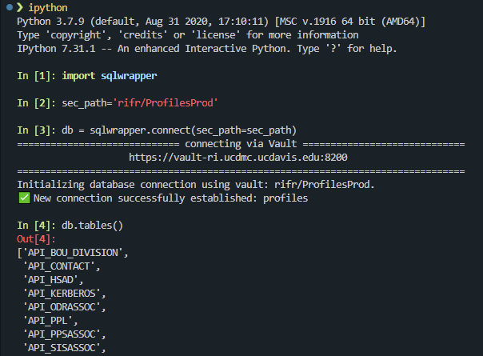

# sqlwrapper

This is a very robust python-SQL database wrapper designed to centralize your
database connections into a single object. It provides pandas-like syntax, and 
an object-oriented experience where all common functions are aggregated into
a single `db` object. This library aims to abstract the complicated formatting 
of connection strings to be database agnostic. The Oracle, SQLServer, and MariaDB 
implementations are the most robust; additional database connections exist 
but may require further development.

# 00. Installation
See [Installation](docs/installation.md) for more details.

`pip install -i https://repos.ri.ucdavis.edu/python --extra-index-url https://pypi.org/simple sqlwrapper`

Alternatively:

`pip install pandas pyodbc cx-oracle sqlalchemy python-dotenv hvac openpyxl`
`pip install -i 'https://repos.ri.ucdavis.edu/python' sqlwrapper`

Be sure to complete one of the following setup:
* [Usage with vault](docs/setup_vault.md)
* [Usage with db_config.ini](docs/setup_db_config.md)

Use the following parameters in your config or vault secrets: [parameters](docs/parameters.md)


# 01. Quickstart
## Connect

```python
import pandas as pd
import numpy as np
import sqlwrapper

# Four methods: initalize the database conneciton object
db = sqlwrapper.connect() # this will generate a menu from your db_config file
db = sqlwrapper.connect('ORACLE_DB_ENTRY')
## via vault, assumes .env file is in the current directory
sec_path = 'rifr/ProfilesProd'
db = sqlwrapper.connect(sec_path=sec_path)
```

Then, test your connection with `db.tables()`. This will simply list all the
tables in the database.

## Usage
A few familiar `pandas` and `sqlalchemy`-esque functions available:
* `db.read_sql('SELECT * FROM tbl_name')`
* `db.columns('tbl_name')` - returns pandas columns of table
* `db.select('tbl_name', limit=None)` - selects table with no limit; default is 10
* `db.insert(df, 'tbl_name')`- use this for `cx_Oracle`'s `executemany()` inserts; table must exist; alternatively use `pd.to_sql()`
* `db.tables()` - returns list of tables
* `db.views()` - returns list of views
* `db.engine` - `sqlalchemy` object engine
* `db.inspector` - `sqlalchemy` object inspector

## Sqlalchemy's engine
Some additional ideas of usage. More info here: https://docs.sqlalchemy.org/en/20/tutorial/dbapi_transactions.html#committing-changes

```
with db.engine.connect() as conn:
    conn.execute(query)
    # on exit, the transaction is automatically rolled back, commit as you go

with db.engine.begin() as conn:
    conn.execute()
    # transaction is automatically commited if no errors
```


# 02. Tutorial
# I. DQL
## A. Select
```python
# note, limit flag is databse agnostic
df_upload = db.select('TBL_NAME', limit=None, where='x = y') # returns a pandas df
```

## B. Database inspection: Tables
```python
# db-agnostic, returns list of all tables of connected database
db.tables()

```

## C. Database inspection: Views
```python
# db-agnostic, returns list of all views of connected database
db.views()

```

## Database inspection: Columns
```python
# columns - returns pandas index of columns
db.columns('TBL_NAME')
# columns - verbose flag
db.columns('TBL_NAME', verbose=True)
```

# II. DML
## A. Insert

```python
# uploading df to Oracle database (create table first)
# db.to_oracle(df_upload, 'TBL_NAME') - this is now deprecated
db.insert(df_upload, 'TBL_NAME')
```

This function is crucial for Oracle, which doesn't have `pd.DataFrame.to_sql()` 
with multi flag built. The function uses cx_Oracle's executemany, so it's much 
faster than. Note, the table must already exist in database; db column 
names must match df's cols exactly.

For SQLServer, MySQL, MariaDB, `df.to_sql()` should be sufficient. Future 
functions may wrap around this or the `executemany()` functions.

See more here: 
* https://pandas.pydata.org/docs/reference/api/pandas.DataFrame.to_sql.html


## B. Update

Using a for loop, this function can help automate writing the `UPDATE` statements.

```python
for idx, row in df.iterrows():
    #db.update('tbl_name', 'set_col', 'set_val', 'cond_col', 'condition')
    db.update('MAPPED_TITLE', #tbl_name
                'TM_COHORT', #set_col
                f"'{row['TM_COHORT']}'", #set_value
                'TITLECODE', #conditional_column
                f"'{str(row['TITLECODE']).rjust(6,'0')}'", #condition
                autocommit=True)

    # This will print and execute the following code:
    ## UPDATE MAPPED_TITLE 
    ## SET TM_COHORT = {set_value} 
    ## WHERE TITLECODE = '000136';
```
## C. Truncate
```python
# quickly truncate a table of data
db.truncate('API_TABLE', answer='yes')
```

## D. Drop
```python
# drop a table using the db object
db.drop('API_TABLE', answer='yes')
```

# III. Specific Database flavor enhancements

## A. Microsoft SQLServer

This function allow you to switch databases, and it auto-managers disposing 
the engine, updates engine, and updates object's variables

```python
In [2]: db.scope()
[Current Scope]
 Server: HSDPATHSQL01
 Database: UCH_COVID19_LDS
 Schema: dbo

In [3]: db.use('COVID_LDS_CORE_DEV')
Current database: UCH_COVID19_LDS.dbo
Change to database: COVID_LDS_CORE_DEV.dbo
Are you sure you want to change databases? (y/n) >> y
✅ New connection successfully established: COVID_LDS_CORE_DEV.dbo

In [4]: db.scope()
[Current Scope]
 Server: HSDPATHSQL01
 Database: COVID_LDS_CORE_DEV
 Schema: dbo
```

## B. Oracle

Not specific, but significiant performance improvement.

```python
db.insert(df, 'TBL_NAME')
```
## Oracle specific setups

Example of `~/.bashrc`

```bash
# Duke's Oracle 19.3c client env var
# Date: 2021-10-20  
# Oracle Environmental Variables
#----------------------------------
export ORACLE_BASE="/opt/oracle"
export ORACLE_HOME="/opt/oracle/instantclient_19_6" # this may vary for you
export LD_LIBRARY_PATH="$ORACLE_HOME/lib:$LD_LIBRARY_PATH" # this may vary for you
export TNS_ADMIN="$ORACLE_HOME/network/admin"
export PATH="$ORACLE_HOME/bin:$PATH"

```

# IV. Access to SQLAlchemy's objects

If you are familiar with SQLAlchemy, a couple of objects are generated as part 
of the `db` object for convenience if functions are not yet built. This way, 
if you're already familiar with that framework, you have access too.

## A. Engine
```python
# sqlalchemy engine available within object
from sqlalchemy import text
query = text('SELECT * FROM TBL_NAME')
db.read_sql(query, db.engine)
```

## B. Inspector

For more information on the inspector, see [here](https://docs.sqlalchemy.org/en/14/core/reflection.html#fine-grained-reflection-with-inspector).
```python
db.inspector.get_pk_constraint('TBL_NAME')
db.inspector.get_columns('TBL_NAME')
db.inspector.get_pk_constraint('TBL_NAME')
```


# 03. Notes to myself

# I. TO-DOs
* add sqlserver.insert() support # executemany
* add mariadb.insert() support # executemany
* add Dockerfile or guide on installing database drivers
* add support for DSN 

# II. Notes on Database drivers

You must ensure that all your Oracle drivers are setup properly. 
* How-To: install the full Oracle 19.3c instantl
* How-To: connect to Microsoft SQL Server using python and pyodbc
* How-To: connect to an Oracle Database using python3.6+ and cx_Oracle

TO-DO: Generate guides or provide Dockerfile

# III. ChangeLog
0.2.8 - Added vault support
0.2.7 - Added synonyms in `parameters.py`; added patches to address sqlalchemy 2.0+ breaking changes; use `self.read_sql` in `base.py` instead of `pd.read_sql()`
0.2.5 - 
0.2.4 - added new features, such as `connect()`, `ls()`, `entries()`, `config(open=False)` 